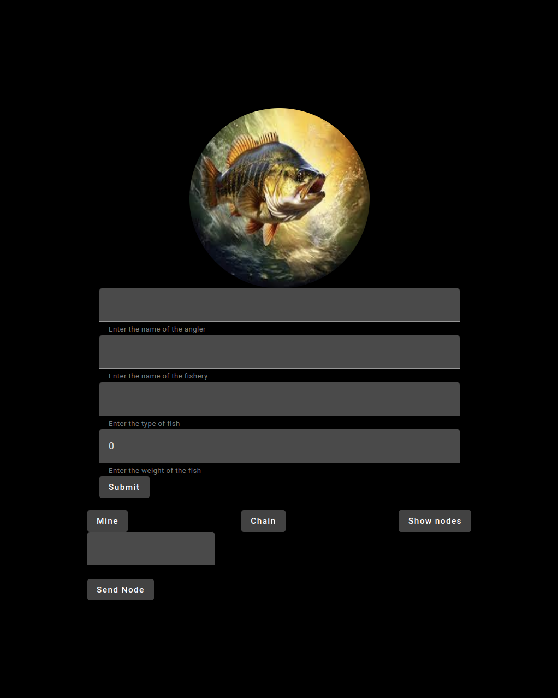

# Karas Coin App
This project implements an Angular-based frontend for interacting with the Fishing Blockchain system. The frontend provides a user-friendly interface for managing and viewing fishing transactions, registering nodes, and viewing the blockchain status. This project is part of a university project to demonstrate the application of blockchain technology in managing fishing-related data. [Backend](https://github.com/matiz22/KarasCoin)

## Installation


1. 
```bash
    git clone https://github.com/matiz22/KarasKoinApp.git
```

2. 
```bash
    npm install
```

3. 
```bash
    ng serve
```
    

